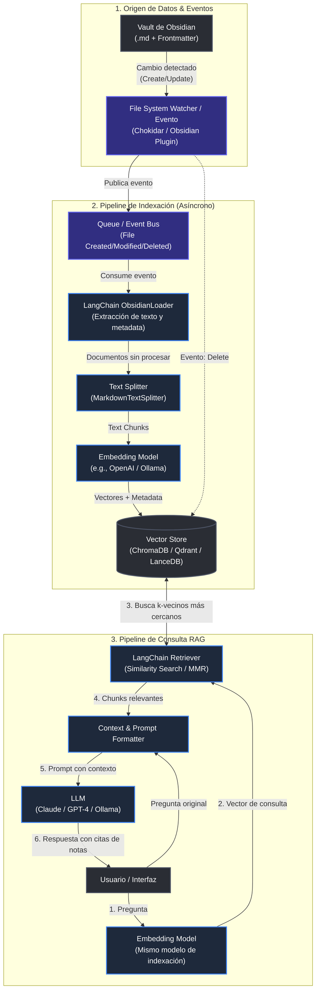

# obsidian-with-rag

Search Obsidian notes using a RAG.

Architecture:

```mermaid
graph TD
    %% Estilos y Clases
    classDef storage fill:#2A2D34,stroke:#4B5263,stroke-width:2px,color:#FFF;
    classDef process fill:#1E293B,stroke:#3B82F6,stroke-width:2px,color:#FFF;
    classDef event fill:#312E81,stroke:#6366F1,stroke-width:2px,color:#FFF;
    classDef flow stroke:#3B82F6,stroke-width:2px;

    %% BÓVEDA DE OBSIDIAN Y EVENTO
    subgraph S1 ["1. Origen de Datos & Eventos"]
        Vault[" Vault de Obsidian<br/>(.md + Frontmatter)"]:::storage
        Watcher[" File System Watcher / Evento<br/>(Chokidar / Obsidian Plugin)"]:::event
    end

    %% PIPELINE DE INDEXACIÓN (EVENT-DRIVEN)
    subgraph S2 ["2. Pipeline de Indexación (Asíncrono)"]
        EventBus[" Queue / Event Bus<br/>(File Created/Modified/Deleted)"]:::event
        Loader[" LangChain ObsidianLoader<br/>(Extracción de texto y metadata)"]:::process
        Splitter[" Text Splitter<br/>(MarkdownTextSplitter)"]:::process
        EmbedderIndex[" Embedding Model<br/>(e.g., OpenAI / Ollama)"]:::process
        VectorDB[(" Vector Store<br/>(ChromaDB / Qdrant / LanceDB)")]:::storage
    end

    %% PIPELINE DE CONSULTA (RAG)
    subgraph S3 ["3. Pipeline de Consulta RAG"]
        User[" Usuario / Interfaz"]:::storage
        EmbedderQuery[" Embedding Model<br/>(Mismo modelo de indexación)"]:::process
        Retriever[" LangChain Retriever<br/>(Similarity Search / MMR)"]:::process
        ContextFormatter[" Context & Prompt Formatter"]:::process
        LLM[" LLM<br/>(Claude / GPT-4 / Ollama)"]:::process
    end

    %% FLUJO DE INDEXACIÓN POR EVENTOS
    Vault -- "Cambio detectado<br/>(Create/Update)" --> Watcher
    Watcher -- "Publica evento" --> EventBus
    EventBus -- "Consume evento" --> Loader
    Loader -- "Documentos sin procesar" --> Splitter
    Splitter -- "Text Chunks" --> EmbedderIndex
    EmbedderIndex -- "Vectores + Metadata" --> VectorDB

    %% FLUJO DE CONSULTA (RAG)
    User -- "1. Pregunta" --> EmbedderQuery
    EmbedderQuery -- "2. Vector de consulta" --> Retriever
    VectorDB <-->|"3. Busca k-vecinos más cercanos"| Retriever
    Retriever -- "4. Chunks relevantes" --> ContextFormatter
    User -- "Pregunta original" --> ContextFormatter
    ContextFormatter -- "5. Prompt con contexto" --> LLM
    LLM -- "6. Respuesta con citas de notas" --> User

    %% Vincular flujo de eliminación
    Watcher -. "Evento: Delete" .-> VectorDB
```
